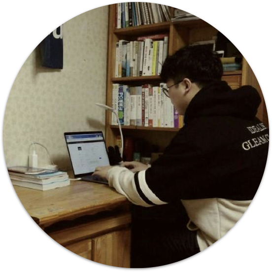

  
  <h1 align="center">Jaemin's resume</h1>
  
안녕하세요 개발자 이재민입니다!

  
<a href="https://j911.me" target="_blank">🔗 J911.me</a>

  
<a href="https://github.com/J911/resume/blob/master/en.md" target="_blank">🇺🇸영어 </a><a href="https://github.com/J911/resume/blob/master/ko.md" target="_blank">🇰🇷한국어</a>

## 학력
- 국립한밭대학교 4학년 재학중
- 장학: 미래인재육성장학재단 장학생 (4년 전액 장학생)

## Projects
### codeveloper:
💻 여러 개발자가 실시간으로 개발 가능한 웹기반의 IDE 플랫폼

- Homepage: [https://github.com/J911/codeveloper/blob/master/README.md](https://github.com/J911/codeveloper/blob/master/README.md)
- Development Report: [https://www.slideshare.net/ssuser827c0b/codeveloper-98231390](https://www.slideshare.net/ssuser827c0b/codeveloper-98231390)
- Repository: [https://github.com/J911/codeveloper](https://github.com/J911/codeveloper)
- Demo: [https://www.youtube.com/watch?v=lpQRb---oGI&feature=youtu.be](https://www.youtube.com/watch?v=lpQRb---oGI&feature=youtu.be)
- Stack: 
  - backend: Node Js, Express Js, Mysql, Socket.io, Docker
  - frontend: Vue Js, Webpack3, CodeMirror, FontAswome, Axios, Vuex

### restful-api-todo-app: 
RESTFul지향의 TODO API 서버
- Homepage: [https://github.com/J911/restful-api-todo-app/blob/master/README.md](https://github.com/J911/restful-api-todo-app/blob/master/README.md)
- Repository: [https://github.com/J911/restful-api-todo-app](https://github.com/J911/restful-api-todo-app)
- Demo: [http://todo-api.j911.me/api-docs](http://todo-api.j911.me/api-docs)
- Stack: Nodejs, Express, MonoDB, JWT, Typescript, Swagger

### dambaesingo:
🚬🚫 담배피는 고등학생을 신고하기 위해 개발한 애플리케이션

- Homepage: [https://github.com/J911/dambaesingo/blob/master/README.md](https://github.com/J911/dambaesingo/blob/master/README.md)
- Repository: [https://github.com/J911/dambaesingo](https://github.com/J911/dambaesingo)
- Demo: [https://dambaesingo.github.io](https://dambaesingo.github.io)
- Stack: Node Js, Kakao API, Express, Typescript,MongoDB
- Server: ubuntu 16, Nginx, SSL(letsencrypt), Cloudflare, PM2

### running-ryan:
🎮 러닝 라이언 (HTML5 GAME)

- Homepage: [https://github.com/J911/running-ryan/blob/master/README.md](https://github.com/J911/running-ryan/blob/master/README.md)
- Repository: [https://github.com/J911/running-ryan](https://github.com/J911/running-ryan)
- Demo: [https://j911.me/running-ryan](https://j911.me/running-ryan)
- Stack: HTML5, CSS, JS

### chicken-fry-theme:
🍗지킬 기반의 블로그 테마

- Homepage: [https://github.com/J911/chicken-fry-theme/blob/master/README.md](https://github.com/J911/chicken-fry-theme/blob/master/README.md)
- Repository: [https://github.com/J911/chicken-fry-theme](https://github.com/J911/chicken-fry-theme)
- Demo: [https://j911.me](https://j911.me)
- Stack: HTML5, CSS, JS

### ng-memo-app: 
📋 앵귤러 JS를 기반으로 개발한 TODO 앱

- Homepage: [https://github.com/J911/ng-memo-app/blob/master/README.md](https://github.com/J911/ng-memo-app/blob/master/README.md)
- Repository: [https://github.com/J911/ng-memo-app](https://github.com/J911/ng-memo-app)
- Demo: [https://j911.me/ng-memo-app/dist/ng-memo-app](https://j911.me/ng-memo-app/dist/ng-memo-app)
- Stack: Typescript, Angular Js, LocalStorage

## 경험
- **언어(level 0~10):**   
C(7), C++(3), Java(5), PHP(4), Python(4), VisualBasic(3), Javascript(8), Typescript(6), HTML(9), CSS(9), Swift(1) ...

- **프레임워크 및 라이브러리:**   
Express(js), React(js), Vue(js), jQuery(js), Nuxt(js), Angular(js), Spring(java), awt(java) ...

- **운영체제**:   
Windows, Ubuntu, macOs, Android, IOS

- **서버:**   
AWS(EC2, RDB, S3), FireBase, Apache, Nginx

- **데이터베이스:**    
MySQL, MongoDB, MariaDB, RDB

- **툴:**   
Git, Docker, Redis, PM2, Wireshark, Android Studio, Google Analytics ...

- **기타...:**   
MQTT, Websocket, WebRTC ...

## 수강이력
소프트웨어공학(UML), 
C 프로그래밍, 
고급 C 프로그래밍, 
객체지향 프로그래밍(C++), 
Java 프로그래밍, 
임베디드 소프트웨어(atmega2560), 
모바일 프로그래밍(Android), 
데이터베이스,
자료구조, 
알고리즘, 
선형대수학,
인공지능,
웹프로그래밍,
데이터통신,
이동통신 프로토콜,
컴퓨터 네트워크(TCP/IP),
유닉스 시스템,
운영체제,

## 경력
### DAREUNKOREA Inc. (CTO, 2016 ~ 2018.4)
책임 프로젝트:
- **웹기반 실시간 서비스(Web based Realtime Communication Service ‘CON’)**   
Stack: Node Js, MariaDB, websocket, Nginx
- **Google Maps API를 사용하는 폐쇠형 SNS**   
Stack: AWS(EC2, S3, RDB), Node Js, Google API
- **모의 창업 플랫폼(Development of Real-Time Simulation Platform)**    
Stack: Node Js, MariaDB, Radis, WebSocket
- **투자자 & 기업 매칭 플랫폼(Investor & Company Matching Online Platform)**    
Stack: Node Js, MariaDB, jQuery

### Techand Inc. (Web Developer, 2018.06 ~)
프로젝트:
- **MQTT를 활용한 IoT제어 인터페이스(Real-time home IoT control interface using MQTT)**   
Stack: MQTT, Typescript, PostgreSQL

## My Links 🔗

- github: [https://github.com/j911](https://github.com/j911)
- blog: [https://j911.me](https://j911.me)
- linkedin: [https://linkedin.com/in/jaemin-lee-8850b7152/](https://linkedin.com/in/jaemin-lee-8850b7152/)
- facebook: [https://facebook.com/jaemin.org](https://facebook.com/jaemin.org)
- instagram: [https://www.instagram.com/j911.me](https://www.instagram.com/j911.me)

## 연락하기
Email: jaemin.lee.email@gmail.com
